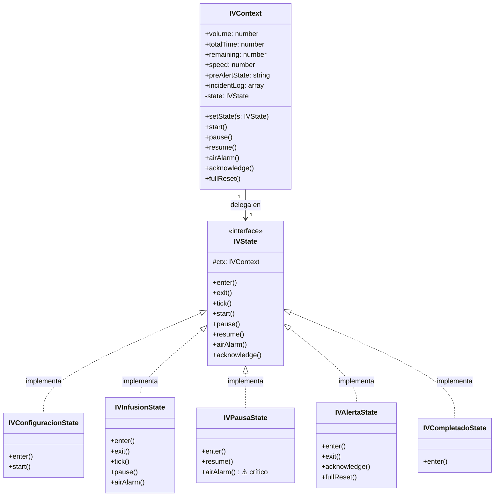
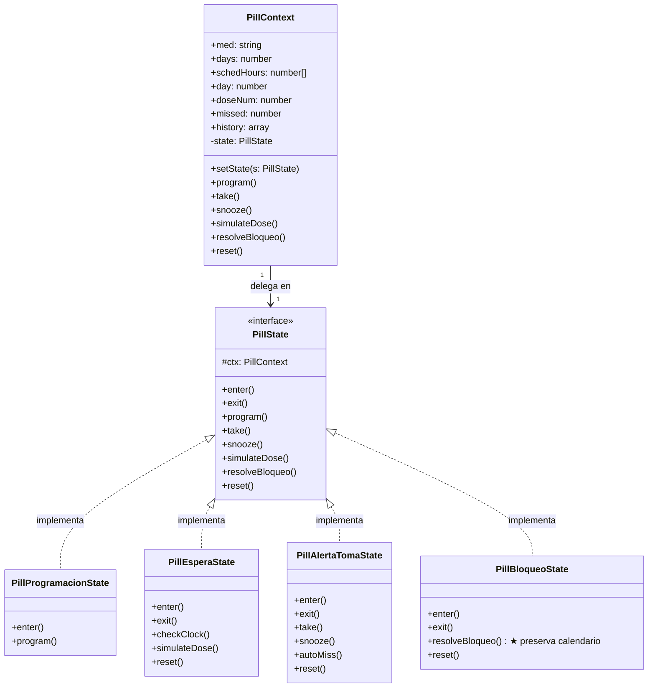
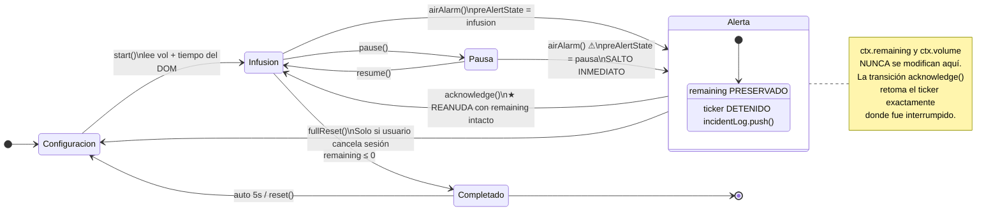
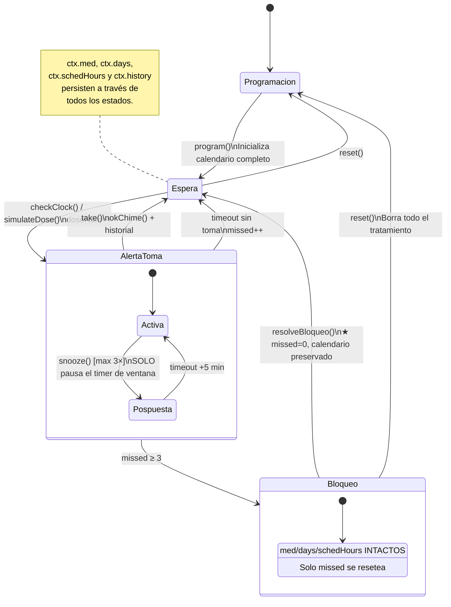
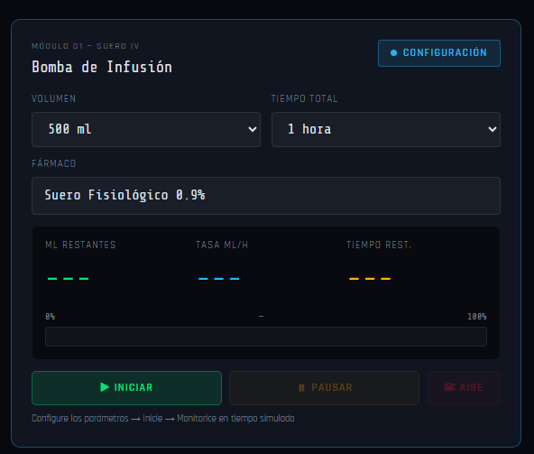
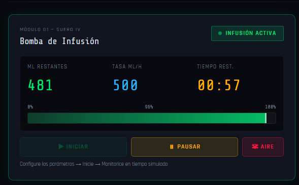
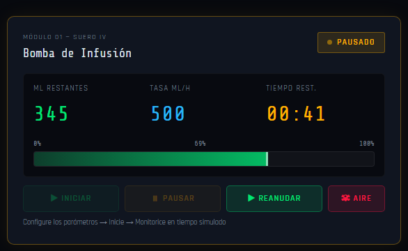
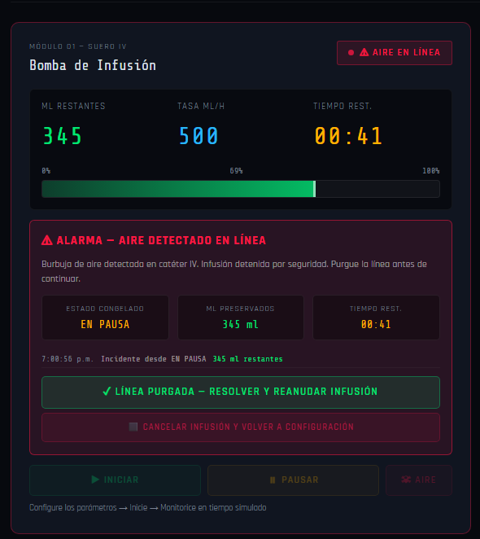
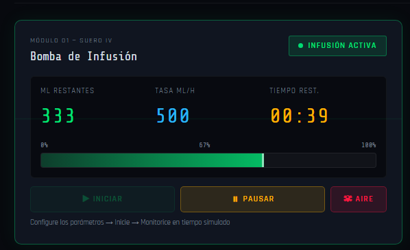
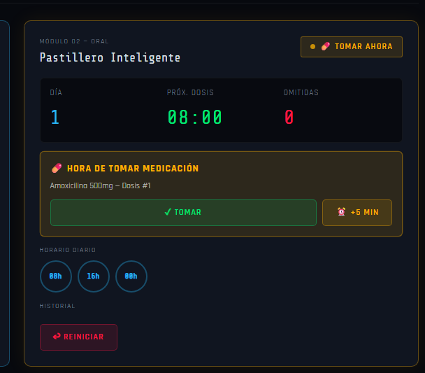

# PatronDeEstado

<div align="center">

# 🏥 MedControl Pro
### Sistema Inteligente de Gestión de Medicación

*Simulador de Bomba de Infusión IV y Dispensador Oral con Patrón de Diseño Estado*

[](.)
[](.)
[](.)
[](.)

</div>

---

## 📋 Tabla de Contenidos

1. [Introducción y Objetivo](#1-introducción-y-objetivo)
2. [Análisis del Patrón de Diseño Estado](#2-análisis-del-patrón-de-diseño-estado)
3. [Características Técnicas y Resiliencia](#3-características-técnicas-y-resiliencia)
4. [Modelado Visual (Diagramas)](#4-modelado-visual-diagramas)
5. [Implementación del Código](#5-implementación-del-código)
6. [Guía de Ejecución y Capturas](#6-guía-de-ejecución-y-capturas)
7. [Conclusión](#7-conclusión)

---

## 1. Introducción y Objetivo

**MedControl Pro** es un simulador web de gestión de medicación clínica diseñado con fines académicos y de demostración de arquitecturas de software críticas. El sistema modela con precisión los dos vectores principales de administración de fármacos en entornos hospitalarios:

- 💉 **Módulo IV — Bomba de Infusión:** Controla el flujo de suero intravenoso calculando la tasa de goteo proporcional (ml/h), la barra de progreso en tiempo real y la detección de aire en la línea. Puede operar a velocidad real (1×) o simulada (hasta 300×).

- 💊 **Módulo Oral — Dispensador Inteligente:** Gestiona un calendario de dosificación configurable (hasta 30 días, múltiples frecuencias), emite alertas sonoras y visuales en cada toma programada, y registra el historial completo de dosis tomadas, pospuestas y omitidas.

### Objetivo Principal

El propósito central del proyecto es demostrar la aplicación del **Patrón de Diseño Estado** (*State Pattern*, GoF) en un dominio donde las transiciones incorrectas tienen consecuencias críticas de seguridad. El sistema prueba que una máquina de estados bien diseñada puede:

1. Garantizar que **ninguna transición ilegal** sea posible desde ningún estado.
2. Preservar los datos de sesión (volumen restante, calendario de días) a través de interrupciones de alerta.
3. Escalar hacia nuevos estados sin modificar el código existente (**Principio Abierto/Cerrado**).

---

## 2. Análisis del Patrón de Diseño Estado

### 2.1 Teoría del Patrón

El **Patrón de Diseño Estado** (GoF - *Gang of Four*) pertenece a la categoría de patrones de comportamiento. Permite a un objeto alterar su comportamiento cuando su estado interno cambia, haciendo que el objeto parezca cambiar de clase.

Su arquitectura se compone de tres participantes fundamentales:

```
┌─────────────┐       delega en       ┌──────────────┐
│   Context   │ ─────────────────────▶│    IState    │
│             │                       │  (interfaz)  │
│ -state      │◀──────────────────────│  +enter()    │
│ +setState() │     implementa        │  +exit()     │
└─────────────┘                       │  +handle()   │
                                      └──────┬───────┘
                                             │ implementan
                          ┌──────────────────┼──────────────────┐
                          ▼                  ▼                   ▼
                  ┌──────────────┐  ┌──────────────┐  ┌──────────────┐
                  │ ConcreteStateA│  │ ConcreteStateB│  │ ConcreteStateC│
                  └──────────────┘  └──────────────┘  └──────────────┘
```

| Participante | Rol | En este proyecto |
|---|---|---|
| **`IState`** | Interfaz o clase abstracta que declara los métodos que cada estado concreto debe implementar | `IVState` / `PillState` |
| **`Context`** | Mantiene una referencia al estado actual y delega las llamadas a él | `IVContext` / `PillContext` |
| **Estado Concreto** | Implementa el comportamiento asociado a un estado específico del `Context` | `IVInfusionState`, `IVAlertaState`, etc. |

La clave del patrón es que el **`Context` nunca contiene lógica condicional** — simplemente llama a `this.state.handle()` y el objeto de estado activo sabe exactamente qué hacer.

### 2.2 Por qué es superior a `if/else` en entornos médicos

Considérese el caso crítico: detección de **aire en la línea IV** estando el sistema en estado de **Pausa**.

**❌ Implementación ingenua con `if/else`:**

```javascript
// PELIGROSO: cualquier caso no cubierto falla silenciosamente
function manejarAlarmaAire(estadoActual) {
    if (estadoActual === "infusion") {
        detenerBomba();
        activarAlarma();
    } else if (estadoActual === "completado") {
        // Ya terminó, ignorar
    }
    // ⚠️ OMISIÓN SILENCIOSA: "pausa" no está cubierto.
    // En estado Pausa, la alarma de aire NO se activa.
    // Error crítico de seguridad. El compilador no lo detecta.
}
```

**✅ Implementación con Patrón Estado:**

```javascript
class IVPausaState extends IVState {
    // La clase GARANTIZA por estructura que este caso existe.
    // No puede ser olvidado — la interfaz lo exige.
    airAlarm() {
        // ★ Transición de seguridad crítica: Pausa → Alerta
        // Es atómica: exit() libera recursos, enter() activa alarma.
        this.ctx.preAlertState = 'pausa';
        this.ctx.setState(new IVAlertaState(this.ctx));
    }
}
```

La tabla siguiente resume las diferencias estructurales:

| Criterio | `if/else` | Patrón Estado |
|---|---|---|
| **Omisión de casos** | Silenciosa — falla en runtime | Imposible por estructura — la interfaz fuerza implementación |
| **Complejidad al escalar** | O(n²) — cada nuevo estado requiere revisar todas las ramas | O(n) — nueva clase aislada, sin tocar el código existente |
| **Condiciones de carrera** | Alta probabilidad — estado puede cambiar entre checks | Ninguna — transiciones atómicas con `exit()` → `enter()` |
| **Auditoría de cobertura** | Manual y propensa a error | Automática — herencia garantiza contrato completo |
| **Principio de Responsabilidad Única** | Violado — función central gestiona todos los casos | Respetado — cada clase tiene una sola razón de cambio |
| **Testabilidad** | Difícil — hay que mockear múltiples rutas | Simple — cada estado se testea de forma aislada |

---

## 3. Características Técnicas y Resiliencia

### 3.1 Persistencia de Datos Durante una Alerta

La propiedad más importante del sistema es que **los datos de sesión nunca se destruyen** cuando ocurre una alerta de aire. Esto se logra mediante una separación estricta de responsabilidades:

- **El `Context` es el único propietario de los datos:**
  ```
  IVContext {
      volume: 500,        // ← inmutable durante la sesión
      totalTime: 3600,    // ← inmutable durante la sesión
      remaining: 247.3,   // ← congelado al entrar a Alerta, NUNCA borrado
      preAlertState: 'infusion' | 'pausa',
      incidentLog: [...]  // ← registro append-only de incidentes
  }
  ```

- **`IVAlertaState` solo *lee* el contexto, nunca lo *escribe*:**
  ```javascript
  enter() {
      // Solo captura un snapshot para display. No modifica ctx.remaining.
      const remSnap = Math.round(this.ctx.remaining);  // lectura
      document.getElementById('ivAlarmRem').textContent = remSnap + ' ml';
  }
  ```

- **El `setInterval` del ticker se detiene en `IVInfusionState.exit()`**, garantizando que `remaining` no siga decrementando durante la alerta.

### 3.2 Ciclo de Reanudación Automática

El flujo completo de una interrupción resiliente es:

```
[Infusión activa: remaining=247ml]
        │
        │ airAlarm()  ←── puede venir desde Infusión O desde Pausa
        ▼
[Estado Alerta]
    ├── ctx.remaining = 247ml  ✓ (no tocado)
    ├── ticker DETENIDO        ✓ (clearInterval en exit de Infusión)
    ├── display muestra snapshot frozen
    └── incidentLog.push({time, origin, rem})
        │
        │ acknowledge()  ←── "Línea purgada — Resolver y Reanudar"
        ▼
[IVInfusionState.enter()]
    ├── ctx.remaining = 247ml  ✓ (intacto)
    ├── ticker REINICIADO con setInterval
    ├── IU actualizada con ivUI.update(ctx)
    └── Infusión continúa desde 247ml, no desde 500ml
```

### 3.3 Módulo Oral — Resiliencia del Calendario

Para el Dispensador Oral, el principio es análogo: **el calendario de tratamiento vive en el `Context`, no en ningún estado**:

| Evento | Datos afectados | Datos preservados |
|---|---|---|
| **Snooze** (+5 min) | Solo pausa el timer de la ventana de alerta | `med`, `days`, `schedHours`, `day`, `doseNum`, `history` |
| **Omisión de dosis** | `missed++` | Todo lo demás |
| **Bloqueo → Continuar** (`resolveBloqueo`) | `missed = 0` | `med`, `days`, `schedHours`, `day`, `doseNum`, `history` |
| **Reinicio total** (`reset`) | Todo | — |

La diferencia entre "resolver sin perder datos" y "reiniciar completo" se materializa en **dos métodos de estado distintos**, cada uno con su botón de UI dedicado.

---

## 4. Modelado Visual (Diagramas)

### 4.1 Diagrama de Clases UML — Estructura del Patrón





### 4.2 Máquina de Estados — Bomba de Infusión IV



### 4.3 Máquina de Estados — Dispensador Oral



---

## 5. Implementación del Código

### 5.1 Interfaz Base y Context 

```javascript

class IVState {
    constructor(ctx) { this.ctx = ctx; }
    enter()      {}   // Se llama al activar este estado
    exit()       {}   // Se llama al abandonar este estado (limpieza)
    tick()       {}   // Se llama cada 100ms durante la infusión
    start()      {}
    pause()      {}
    resume()     {}
    airAlarm()   {}   // Interrupción de máxima prioridad
    acknowledge(){}   // Resuelve la alerta y reanuda
    fullReset()  {}   // Cancela la sesión por completo
}


class IVContext {
    constructor() {
        this.volume        = 500;      // ml configurados en formulario
        this.totalTime     = 3600;     // segundos totales de infusión
        this.remaining     = 500;      // ★ NUNCA se borra en Alerta
        this.speed         = 60;       // multiplicador de simulación
        this.timer         = null;     // referencia al setInterval del ticker
        this.preAlertState = null;     // 'infusion' | 'pausa'
        this.incidentLog   = [];       // registro append-only, persiste sesión
        this.state         = null;
    }

    setState(newState) {
        if (this.state) this.state.exit();   // limpieza del estado anterior
        this.state = newState;
        this.state.enter();                  // inicialización del nuevo estado
    }

    // Métodos públicos — el Context no sabe qué estado está activo
    start()      { this.state?.start();      }
    pause()      { this.state?.pause();      }
    resume()     { this.state?.resume();     }
    airAlarm()   { this.state?.airAlarm();   }
    acknowledge(){ this.state?.acknowledge();}
    fullReset()  { this.state?.fullReset();  }
}
```

### 5.2 Estado de Infusión con Cálculo Proporcional

```javascript

class IVInfusionState extends IVState {
    enter() {
        ivUI.panel('s-infusion');
        ivUI.badge('INFUSIÓN ACTIVA', 'green');
        ivUI.show('ivCfg', 0);
        ivUI.show('ivAlarm', 0);
        ivUI.show('ivScan', 1);       // activa la scanline de monitor
        ivUI.btn('ivPause', true, true);
        ivUI.btn('ivAir',   true, true);

        // Inicia el ticker — única fuente de escritura sobre ctx.remaining
        this.ctx.timer = setInterval(() => this.ctx.tick(), 100);
    }

    exit() {
    
        clearInterval(this.ctx.timer);
    }

    tick() {
        // Tasa en ml/seg
        const rateMlPerSec = this.ctx.volume / this.ctx.totalTime;

        // Delta por intervalo de 100ms, escalado por la velocidad de simulación
        const delta = rateMlPerSec * 0.1 * this.ctx.speed;

        this.ctx.remaining = Math.max(0, this.ctx.remaining - delta);
        ivUI.update(this.ctx);

        if (this.ctx.remaining <= 0) {
            this.ctx.setState(new IVCompletadoState(this.ctx));
        }
    }

    pause()    { this.ctx.setState(new IVPausaState(this.ctx)); }

  
    airAlarm() {
        this.ctx.preAlertState = 'infusion';
        this.ctx.setState(new IVAlertaState(this.ctx));
    }
}
```

### 5.3 Estado de Alerta — Captura de Snapshot sin Escritura

```javascript

class IVAlertaState extends IVState {
    enter() {
       
        const now       = new Date().toLocaleTimeString();
        const origin    = this.ctx.preAlertState === 'pausa' ? 'EN PAUSA' : 'EN INFUSIÓN';
        const remSnap   = Math.round(this.ctx.remaining);             // LECTURA
        const rate      = this.ctx.volume / this.ctx.totalTime;
        const tlsSec    = this.ctx.remaining / rate;                  // LECTURA
        const th        = Math.floor(tlsSec / 3600);
        const tm        = Math.floor((tlsSec % 3600) / 60);
        const timeSnap  = `${String(th).padStart(2,'0')}:${String(tm).padStart(2,'0')}`;

        
        this.ctx.incidentLog.push({ time: now, origin, rem: remSnap, timeLeft: timeSnap });
        

        ivUI.panel('s-alerta blink-alarm');
        ivUI.badge('⚠ AIRE EN LÍNEA', 'red');
        ivUI.show('ivAlarm', 1);

        document.getElementById('ivAlarmOrigin').textContent = origin;
        document.getElementById('ivAlarmRem').textContent    = remSnap + ' ml';
        document.getElementById('ivAlarmTime').textContent   = timeSnap;

        startAlarm(); // audio
    }

    exit() { stopAlarm(); }

    acknowledge() {
        this.ctx.setState(new IVInfusionState(this.ctx));
    }

    
    fullReset() {
        this.ctx.setState(new IVConfiguracionState(this.ctx));
    }
}
```

### 5.4 Equivalente en C# (para referencia de sistemas embebidos)

```csharp
// ─────────────────────────────────────────────────────────────
// Interfaz IIVState — Define el contrato de todos los estados
// ─────────────────────────────────────────────────────────────
public interface IIVState
{
    void Enter();
    void Exit();
    void Tick(double deltaSeconds);
    void AirAlarm();
    void Acknowledge();
}

// ─────────────────────────────────────────────────────────────
// IVContext — Propietario de los datos de sesión
// ─────────────────────────────────────────────────────────────
public class IVContext
{
    public double Volume        { get; set; }  // ml totales configurados
    public double TotalTime     { get; set; }  // segundos totales
    public double Remaining     { get; set; }  // ★ NUNCA se borra en Alerta
    public string PreAlertState { get; set; }  // "infusion" | "pausa"

    private IIVState _state;

    public void SetState(IIVState newState)
    {
        _state?.Exit();       // limpieza atómica
        _state = newState;
        _state.Enter();       // inicialización atómica
    }

    public void AirAlarm()   => _state?.AirAlarm();
    public void Acknowledge()=> _state?.Acknowledge();
}


public class IVInfusionState : IIVState
{
    private readonly IVContext _ctx;

    public IVInfusionState(IVContext ctx) => _ctx = ctx;

    public void Enter()  { /* activar UI de infusión */ }
    public void Exit()   { /* detener timer → remaining queda congelado */ }

    public void Tick(double deltaSeconds)
    {
        double rateMlPerSec = _ctx.Volume / _ctx.TotalTime;
        _ctx.Remaining = Math.Max(0, _ctx.Remaining - rateMlPerSec * deltaSeconds);

        if (_ctx.Remaining <= 0)
            _ctx.SetState(new IVCompletadoState(_ctx));
    }

    public void AirAlarm()
    {
        _ctx.PreAlertState = "infusion";
        _ctx.SetState(new IVAlertaState(_ctx));
    }

    public void Acknowledge() { /* no aplica en este estado */ }
}
```

---

## 6. Guía de Ejecución y Capturas

### 6.1 Requisitos

| Requisito | Detalle |
|---|---|
| Navegador | Chrome 90+, Firefox 88+, Edge 90+, Safari 14+ |
| Conexión | Requerida solo para cargar Tailwind CSS y fuentes Google (CDN) |
| Servidor | No requerido — archivo HTML estático |

### 6.2 Ejecución

```bash
# Opción 1 — Abrir directamente
# Descarga MedControlPro.html y ábrelo con doble clic en cualquier navegador moderno.

# Opción 2 — Servidor local (recomendado para evitar restricciones CORS de audio)
npx serve .
# O con Python:
python -m http.server 8080
# Luego navega a: http://localhost:8080/MedControlPro.html
```

### 6.3 Flujo de Demostración Recomendado

```
1. Módulo IV — Configurar: seleccionar 500 ml / 1 hora / velocidad 60×
2. Clic en "▶ INICIAR" → observar barra verde, ml decreciendo
3. Clic en "⏸ PAUSAR" → panel cambia a ámbar
4. Con sistema en PAUSA → clic en "☠ AIRE" → panel parpadea rojo
5. Observar snapshot: ml preservados desde el paso 2
6. Clic en "✓ LÍNEA PURGADA — RESOLVER Y REANUDAR" → infusión continúa
7. Repetir paso 4 desde estado INFUSIÓN para comparar preAlertState

8. Módulo Oral — Configurar: Amoxicilina / 7 días / cada 8 horas
9. Clic en "PROGRAMAR TRATAMIENTO →"
10. Clic en "⚡ SIMULAR DOSIS" 3 veces sin confirmar → estado BLOQUEADO
11. Observar que el calendario de 7 días y el historial siguen presentes
12. Clic en "↩ RECONOCER Y CONTINUAR TRATAMIENTO" → vuelve a ESPERA
```

### 6.4 Capturas de Pantalla

> 📸 *Inserta aquí las capturas tomadas del simulador en cada estado.*

**Panel de Configuración — Estado inicial (azul)**



---

**Infusión activa — Barra de progreso y contador digital (verde)**



---

**Sistema en Pausa — Panel ámbar con datos congelados**



---

**Alerta crítica — Detección de aire (rojo parpadeante)**
*Nótese el snapshot de ml preservados y el historial de incidentes*



---

**Reanudación post-alerta — Infusión continúa desde el punto exacto**



---

**Dispensador Oral — Alerta de toma activa (ámbar)**



---


## 7. Conclusión

### La Persistencia de Datos en Sistemas de Salud Embebidos

En la ingeniería de software médica, la pérdida de contexto durante una interrupción no es un inconveniente menor — puede resultar en una sobredosis si el sistema reinicia el contador de volumen, o en subdosificación si borra el calendario de tomas activo. El imperativo de diseño es claro: **los datos de sesión deben ser inmunes a las transiciones de estado**.

Este proyecto demuestra que el **Patrón de Diseño Estado** no es solo una elección estética — es una decisión de arquitectura con consecuencias directas en la seguridad del sistema:

1. **Separación estructural de datos y comportamiento:** El `Context` posee los datos; los estados poseen la lógica. `IVAlertaState` puede leer `ctx.remaining` para mostrarlo, pero físicamente no tiene acceso de escritura porque ese no es su contrato. La arquitectura hace la violación *difícil*, no solo desaconsejada.

2. **Transiciones como ciudadanos de primera clase:** Al modelar cada transición como un método explícito (`airAlarm()`, `acknowledge()`, `resolveBloqueo()`), el código de negocio es legible como una especificación. Un ingeniero biomédico puede verificar el comportamiento de seguridad leyendo solo los nombres de los métodos, sin descifrar ramas `if/else` anidadas.

3. **Facilidad de mantenimiento a largo plazo:** Cuando los requisitos de un dispositivo médico cambian — nuevo tipo de sensor, nuevo protocolo de alerta, nueva frecuencia de dosis — el patrón Estado garantiza que el cambio se localiza en una clase. No hay regresiones en estados no relacionados porque no se toca el código de esos estados. Esta propiedad es especialmente valiosa en entornos regulados (FDA, ISO 13485) donde cada cambio de código requiere re-validación documentada.

4. **El `incidentLog` como invariante de auditoría:** En dispositivos médicos reales, el registro de cada incidente (cuándo ocurrió, desde qué estado, con cuánto volumen restante) es un requisito regulatorio. Al implementarlo como un array append-only en el `Context`, el patrón garantiza que ningún estado pueda borrarlo — solo pueden añadir entradas.

> *"La calidad de un sistema crítico no se mide por su comportamiento en condiciones normales, sino por su corrección durante una interrupción."*

---

<div align="center">

**MedControl Pro** · Proyecto Académico · Patrón de Diseño Estado (GoF)

*No destinado a uso clínico real.*

[](.)

</div>
